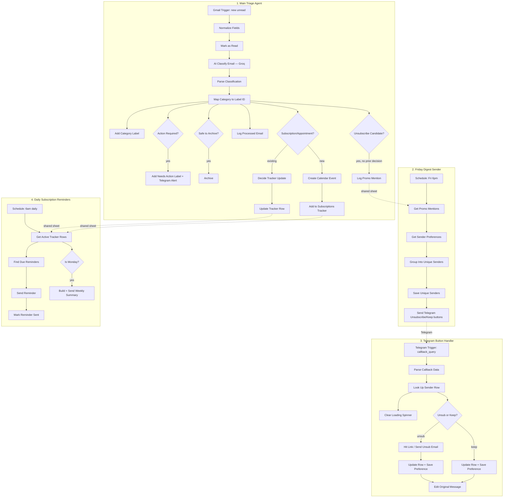

# Workflow Architecture

📹 [Watch the walkthrough on Loom](https://www.loom.com/share/e8d61b73e62b42fd969f259f792750d0)

## System diagram



## Classification schema

Every email is sent to Groq (`openai/gpt-oss-120b`, `reasoning_effort: medium`) with a system prompt requiring this exact JSON shape:

```json
{
  "category": "Urgent | Newsletter | Receipt | Task | Personal | Spam-like",
  "priority": "High | Medium | Low",
  "action_required": true,
  "action_summary": "string",
  "unsubscribe_candidate": false,
  "is_subscription_or_appointment": false,
  "event_type": "subscription_renewal | subscription_expiration | appointment | none",
  "event_date": "YYYY-MM-DD or empty",
  "entity_name": "string or empty",
  "is_reminder_email": false
}
```

**`category` and `action_required` are judged independently.** An email can be `Spam-like` and still have `action_required: true` — a suspicious email demanding a reply is still something a human should see and decide on, even if the right call is to ignore it. This was a deliberate prompt-engineering fix after early testing had the model conflating "looks spammy" with "needs no action."

## Data model (shared Google Sheet, 5 tabs)

| Tab | Purpose |
|---|---|
| `Processed Log` | Every email processed, for auditing/portfolio metrics |
| `Promo Mentions This Week` | Raw log, one row per promotional email seen |
| `Promo Senders This Week` | Deduped weekly list with a `uuid` per sender, referenced by Telegram button `callback_data` |
| `Sender Preferences` | Permanent record of Unsubscribe/Keep decisions — checked before a sender is ever asked about twice |
| `Subscriptions Tracker` | One row per tracked entity, keyed by a normalized `entity_id`, used for dedup against future mentions of the same subscription |

## Bugs found and fixed during build

Kept here deliberately — the debugging process is as informative as the final architecture.

1. **n8n Set node import mismatch.** JSON built against an older Set-node field format imported as a blank node in this n8n version — required manually re-adding all 8 fields with Expression-mode values.
2. **Silent node-name reference breaks.** Code nodes reference upstream nodes by exact string name (`$('Normalize Fields')`). Re-imported nodes picked up a `1` suffix (`Normalize Fields1`), so every reference silently returned `undefined` instead of erroring — the spread operator (`...prior`) swallowed the missing data with no visible failure.
3. **Provider migration mid-build.** Originally built against Anthropic's Claude API, then switched to Groq. Groq uses OpenAI-shaped request/response bodies, not Anthropic's — required restructuring the system prompt (moved from a top-level `system` field into a `system`-role message) and the response parser (`choices[0].message.content` instead of `content[0].text`).
4. **Model deprecation.** The initially chosen Groq model (`qwen/qwen3-32b`) was deprecated mid-build in favor of `openai/gpt-oss-120b`. Its `reasoning_effort` parameter also has a different valid value set (`low/medium/high` vs. the prior model's `none/default`).
5. **Invalid Google Sheets operation name.** Built against `"operation": "search"`, which doesn't exist in this n8n version's Google Sheets node — the correct value is `"read"` with filter parameters.
6. **Wrong data reference after inserting a new node.** Adding a "Mark as Read" Gmail node between two existing nodes broke a downstream `$json` reference, since Gmail nodes replace the incoming data with their own API response rather than passing it through. Fixed by referencing the actual data source node by name instead of relying on immediate upstream `$json`.
7. **`Always Output Data` introduced a new bug while fixing another one.** Zero-row Google Sheets lookups halt downstream execution by default. Enabling "Always Output Data" fixes that — but downstream IF nodes that checked `$items().length === 0` to detect "no existing row" now always saw `1` item (an empty placeholder), flipping their logic backwards. Fixed by checking for the presence of a real field (e.g. `row_number`) instead of item count.
8. **Parallel branches racing in full-workflow execution.** Two Google Sheets reads feeding the same downstream Code node worked fine individually, but failed intermittently ("node hasn't been executed") during full-workflow runs — an n8n timing quirk with parallel branches. Fixed by converting the branches to a sequential chain; the Code node already referenced both sources by name, so execution order didn't otherwise matter.
9. **Telegram callback query timeout.** The loading-spinner acknowledgment sat at the end of the processing chain, so slower steps (hitting an unsubscribe link, writing two sheet rows) sometimes exceeded Telegram's short callback-answer window. Fixed by acknowledging the callback immediately, in parallel with the slower work, rather than waiting for it to finish first.
10. **ngrok pointed at the wrong port.** Tunnel was forwarding to port 80 instead of n8n's actual port (5678), silently breaking all webhook delivery with no error surfaced anywhere obvious — traced via ngrok's own request log rather than n8n.

## Known limitations

- Requires a persistent tunnel (ngrok) for the webhook-based Telegram button handler when self-hosted locally; production deployment would move this to a stable host or n8n cloud
- `reminder_2day_sent` / `reminder_dayof_sent` flags are per-entity, not per-date — if a tracked date changes, flags reset, but this depends on the classifier correctly detecting the date change
- Entity matching for dedup relies on the LLM naming the same subscription consistently across separate emails (e.g. "Netflix" both times); meaningfully different phrasing could create a duplicate tracker row
